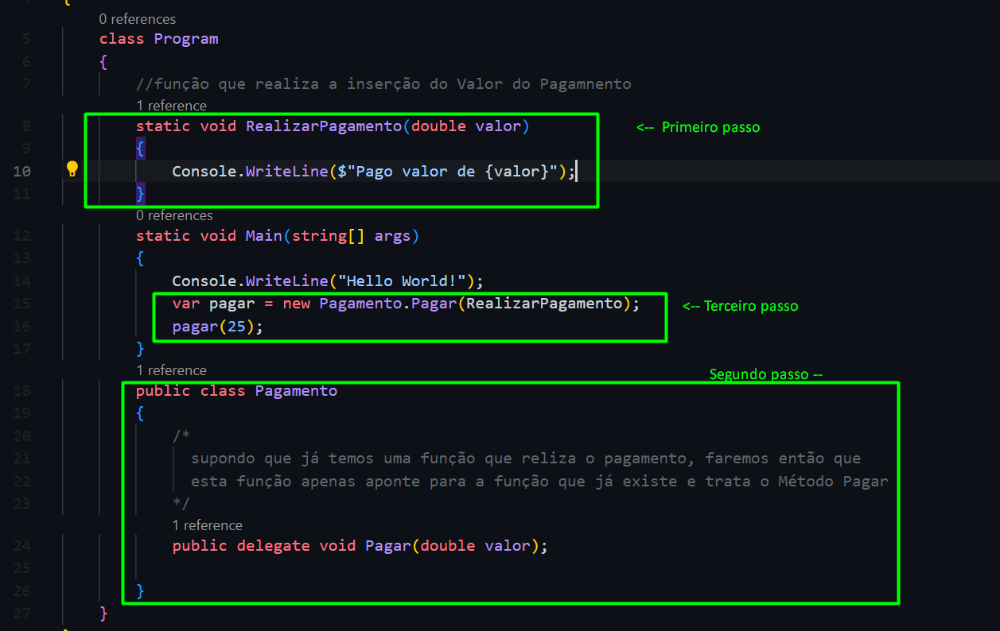

# Delegates 

    Delegate = Delegar - >  se trata de uma função que tem o  objetivo de ser apontada, ou seja 
    para uma função apontar para outra função é necessários terem os mesmo parâmetros e tipos.

    Para utilizar o Delegate, será necessário ter pelo menos 2 métodos, dos quais podem estar na mesmaclasse ou não... sendo assim, um método receberá um valor em sua função e o outro método delegará qualvalor será inputado dentro da função do primeiro método, basicamente sendo um método Ativo e outrométodo Ati

Como fazer : 

- **Passo 1**:
    Criar o Método, o qual receberá um valor, aqui tanto faz seu tipo e tipo de retorno;  

- **Passo 2**:
    Criar outro Método. A função delegate se assemelha a estrutura do método, porem não sendo necessário realiza nada. Precisa somente ser fiel ao método do qual estará apontando (mesmos tipo e tipo de retorno);

- **Passo 3**:
    Agora que temos nosso Método Passivo e nosso delegate, precisamos instanciar o nosso Delegate e chamar sua função para receber o a função do método passivo.   

    
Exemplo : 
#

#